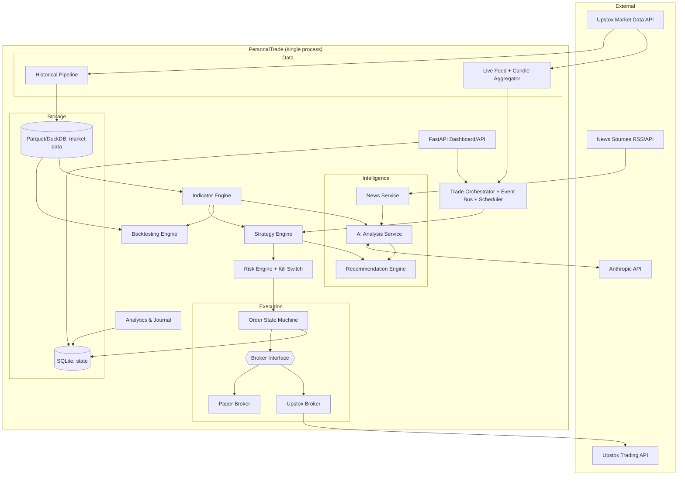
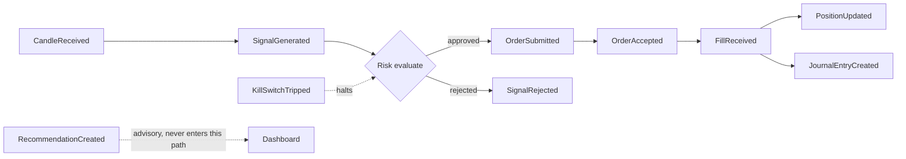

# 01 · System Architecture

## Shape: modular monolith

One Python process, strict internal module boundaries, in-process event bus. Rationale in
[ADR-001](ADRS.md#adr-001): a single-user trading platform gains nothing from distributed services
except failure modes and cost. Replaceability (CLAUDE.md Rule 7) is achieved with interfaces, not
network boundaries. Any module could later be extracted into a service because modules already
communicate only through interfaces and events.

## Component diagram



## Module responsibilities

| Module | Responsibility | Must NOT do |
|---|---|---|
| `core` | Domain models (pydantic), event bus, config, logging, errors, NSE calendar | Business logic |
| `data` | Historical pipeline, live feed, candle aggregation, Parquet/DuckDB store | Trading decisions |
| `indicators` | Deterministic TA as pure functions (batch + incremental) | I/O, state, LLM calls |
| `strategy` | `Strategy` implementations producing `Signal`s | Sizing, order placement |
| `backtest` | Event-driven simulation, cost model, run metrics | Diverge from live `Strategy` interface |
| `risk` | Sizing, limits, kill switch; sole gate producing `ApprovedOrder` | Be bypassable |
| `execution` | `Broker` interface, paper/Upstox implementations, order state machine, reconciliation | Strategy logic |
| `intelligence` | News ingestion, `LLMProvider`, AI analysis, recommendation merge | Touch the order path |
| `analytics` | P&L, equity curve, journal, reports | Alter trade records |
| `orchestrator` | Event loop, scheduling, wiring; owns the "risk is the only path to broker" invariant | Contain domain math |
| `api` | Dashboard + REST + websocket | Reach around orchestrator/repositories |

**Dependency rule:** modules depend on `core` and on each other's *interfaces* only. Import of
another module's internals is a review-blocking violation.

## Folder structure

```
PersonalTrade/
├── CLAUDE.md
├── pyproject.toml                 # uv-managed
├── alembic/                       # migrations
├── config/
│   ├── default.yaml               # committed defaults
│   └── strategies/                # per-strategy parameter files
├── .env.example                   # secrets template (real .env git-ignored)
├── docs/
│   ├── ROADMAP.md
│   └── architecture/
├── data/                          # git-ignored runtime data
│   ├── candles/                   # Parquet datasets
│   ├── personaltrade.db           # SQLite
│   └── logs/
├── src/personaltrade/
│   ├── core/                      # models, events, bus, config, logging, calendar, errors
│   ├── data/                      # providers/, historical/, live/, store/
│   ├── indicators/
│   ├── strategy/                  # base.py, registry.py, strategies/
│   ├── backtest/                  # engine.py, execution_sim.py, costs.py, metrics.py
│   ├── risk/                      # engine.py, sizing.py, limits.py, kill_switch.py
│   ├── execution/                 # broker.py (interface), paper/, upstox/, state_machine.py, reconcile.py
│   ├── intelligence/              # news/, llm/ (provider.py, claude.py), analysis.py, recommend.py
│   ├── analytics/
│   ├── orchestrator/
│   ├── api/                       # FastAPI app, routes, auth, ws
│   └── cli.py                     # `pt` entry point
└── tests/                         # mirrors src; golden/ fixtures; integration/
```

## Event flow

In-process, synchronous-by-default pub/sub (`core.events`). Handlers are small; anything slow is a
scheduled job, not an event handler. Events are pydantic models — typed, loggable, replayable in tests.



Core events: `CandleReceived`, `SignalGenerated`, `SignalRejected`, `OrderSubmitted`,
`OrderAccepted`, `PartialFill`, `FillReceived`, `OrderRejected`, `OrderCancelled`,
`PositionUpdated`, `KillSwitchTripped`, `FeedStale`, `RecommendationCreated`, `NewsIngested`.

## Deployment (sketch — detailed at M19/M20)

- **Where:** the user's Windows machine initially; optionally a small always-on VPS later.
  Single process, `pt run --mode paper|live`, started by a scheduler before market open.
- **State:** everything under `data/` — one directory to back up. Daily backup job (M19).
- **No Docker/K8s** unless a real need appears (ADR-001 consequence: near-zero operational cost).

## Logging & monitoring strategy (summary — detailed at M19)

- `structlog`, JSON lines to `data/logs/`, rotated daily; every event and order transition logged
  with correlation ID (`signal_id` → `order_id` → `trade_id`).
- Metrics derived from logs + DB; alerting via Telegram/email at M19.
- LLM calls logged with token counts and cost for spend tracking.
