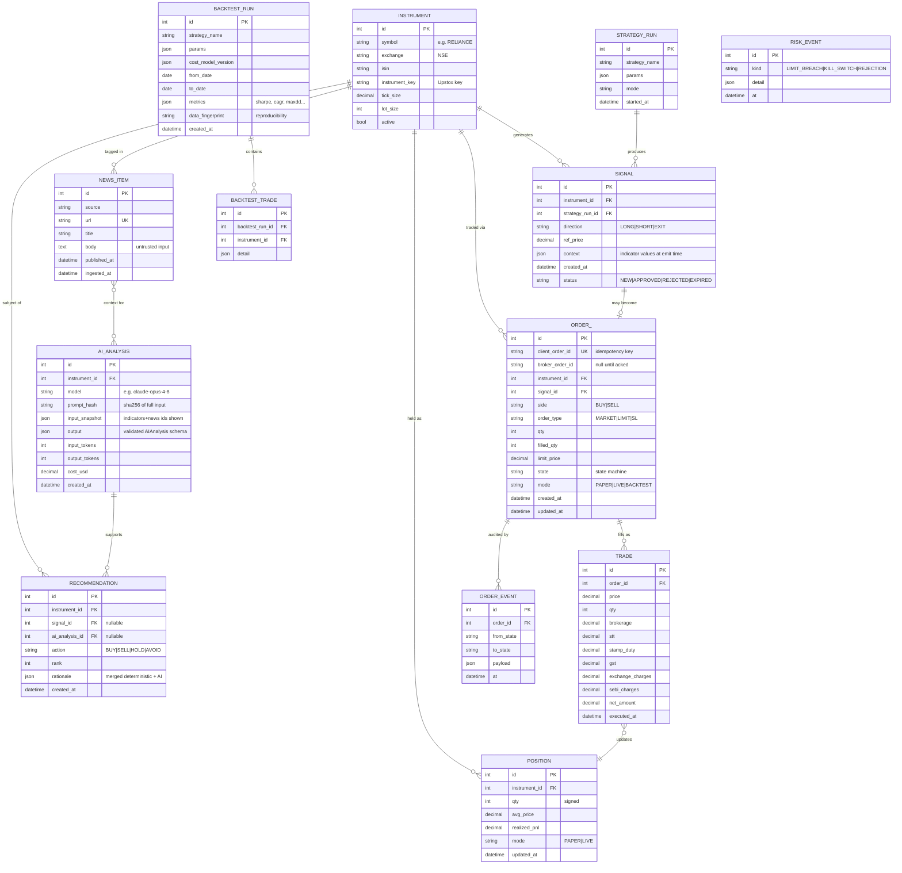

# 02 · Data Model

## Two-store strategy ([ADR-003](ADRS.md#adr-003))

| Store | Contents | Why |
|---|---|---|
| **SQLite** (SQLAlchemy + Alembic, WAL mode) | Transactional state: orders, trades, positions, signals, recommendations, risk events, news, backtest runs | ACID for money-adjacent rows; zero ops; trivially backed up |
| **Parquet + DuckDB** | OHLCV candles, backtest artifacts | Columnar scans over millions of rows; SQLite is the wrong tool for this |

Both sit behind repository interfaces, so either can be replaced (e.g., Postgres/Timescale) without
touching business logic. Money columns are `Decimal` (stored as integer paise or TEXT — decided at
M3), timestamps are UTC.

## ER diagram (SQLite)



## Parquet layout

```
data/candles/{exchange}/{symbol}/{interval}/year=YYYY/part.parquet
```

Columns: `ts_utc, open, high, low, close, volume, oi?`, plus `adjusted` flag and
`adjustment_factor`. DuckDB views expose these as one logical table per interval. A `manifest.json`
per dataset records source, sync time, and validation status.

## Key design decisions

- **`client_order_id` is generated before any broker call** — the idempotency key that makes crash
  recovery and reconciliation possible (see [04-trade-lifecycle.md](04-trade-lifecycle.md)).
- **`ORDER_EVENT` is append-only** — full audit of every state transition, required for debugging
  live incidents and for Rule 14 reconciliation.
- **Per-trade cost columns are explicit** (not a single "fees" blob) because Indian cost structure
  is the difference between a profitable and losing strategy; analytics must break costs down.
- **`AI_ANALYSIS.input_snapshot` + `prompt_hash`** make every AI recommendation reproducible and
  auditable (Rule 10): we can always answer "what did the model see when it said this?"
- **`mode` column everywhere it matters** — paper and live records never mix in aggregates.
