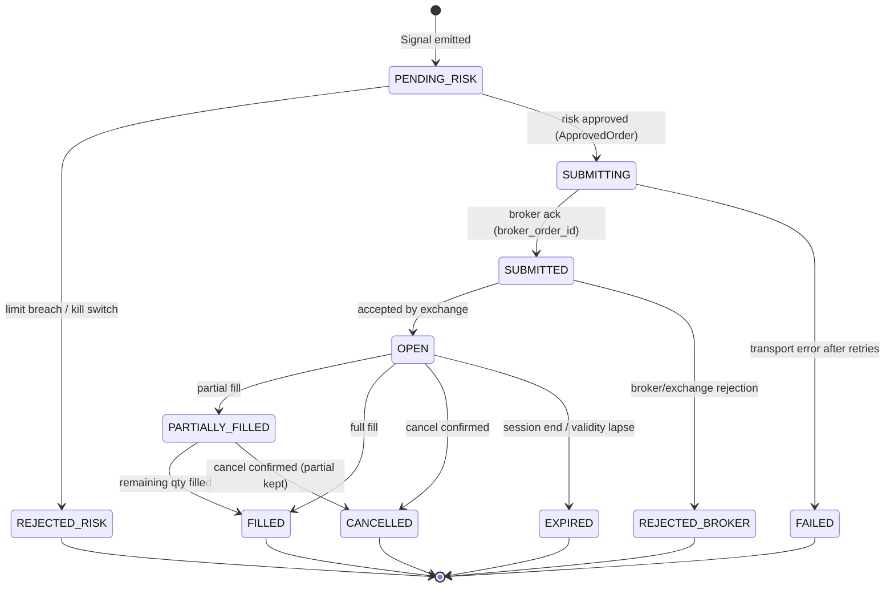
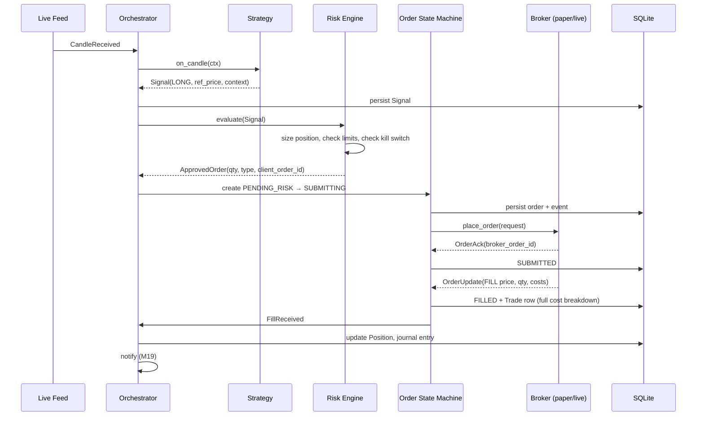

# 04 · Trade Lifecycle

## Order state machine

Every order — backtest, paper, or live — moves through the same states. Transitions are persisted
to `ORDER_EVENT` (append-only) before side effects where possible.

**Idempotency:** `client_order_id` (UUID) is generated and persisted at `PENDING_RISK`. If the
process dies between `SUBMITTING` and the ack, restart-time reconciliation queries the broker by
`client_order_id` to learn the truth — we never double-submit.

## Happy-path sequence

## Reconciliation (startup + periodic)

Runs at process start, after any websocket gap, and every N minutes during market hours:

1. Fetch broker positions, funds, and order statuses.
2. Diff against local `ORDER_`/`POSITION` state.
3. Local order in non-terminal state, unknown to broker → mark `FAILED`, alert.
4. Broker fill missing locally → apply fill, alert (we missed an update).
5. Position quantity mismatch → **broker wins**; local corrected; `RISK_EVENT` logged; if the
   divergence exceeds a threshold, trip the kill switch (something is structurally wrong).

## Kill switch semantics

- Tripped by: max daily loss, max consecutive order errors, reconciliation divergence, manual
  dashboard/CLI action.
- Effect: `Risk.evaluate` rejects everything; open orders are cancelled (configurable); positions
  are optionally flattened (config, default off — human decides).
- Persisted in DB: survives restart; requires explicit human reset with a logged reason.

## Crash-safety invariants

1. Persist intent before action (order row before broker call).
2. Every broker mutation carries `client_order_id`.
3. Recovery = reconciliation, never replay of local intent.
4. Handlers are idempotent: applying the same `OrderUpdate` twice is a no-op (dedup on
   broker event id).
