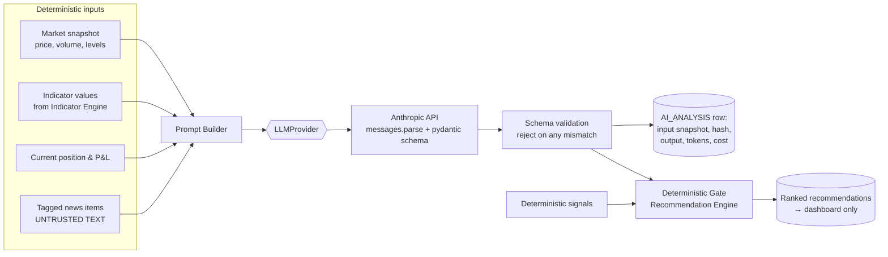

# 05 · AI Data Flow

The AI layer is **advisory only** (CLAUDE.md Rule 10). It ranks, explains, vetoes, and annotates.
It never originates, sizes, or places orders. If the Anthropic API is down, the platform still
trades on deterministic signals — degraded, never blocked.

## Pipeline



## Structured output contract

```python
class AIAnalysis(BaseModel):
    stance: Literal["bullish", "bearish", "neutral"]
    conviction: Literal["low", "medium", "high"]
    key_factors: list[str]           # max ~5, plain language
    risks: list[str]
    news_impact: Literal["positive", "negative", "mixed", "none"]
    summary: str                     # 2-3 sentence explanation for the dashboard
```

- Requested via the Anthropic SDK's `client.messages.parse()` (structured outputs) so the response
  is guaranteed to validate against the schema or fail loudly — no free-text parsing, no regex.
- **No numeric trading fields** (no target price, no quantity, no stop) — by schema design the
  model *cannot* express an order. Deterministic code computes all numbers (Rule 9).

## Deterministic gate rules (Recommendation Engine)

1. A recommendation requires a deterministic basis (strategy signal or screen result); AI alone
   never creates one.
2. AI may **veto** (e.g., `news_impact == "negative"` + high conviction downgrades a BUY to HOLD),
   **rank** (conviction breaks ties), and **explain** (summary shown to the user).
3. Merge weights live in config, default conservative; every merge decision is recorded in
   `RECOMMENDATION.rationale`.
4. Output goes to the dashboard/journal only. Execution consumes signals + risk approval, never
   recommendations.

## Prompt-injection defense

News text is attacker-controlled input. Defenses, in order of importance:

1. **The gate** — even a fully hijacked model output is schema-bound advisory data that cannot
   place orders or change limits.
2. News is wrapped in delimited data blocks with an instruction that its content is data, not
   instructions; titles/bodies are length-clamped and stripped of markup.
3. Red-team fixtures in tests (M14): hostile articles ("ignore previous instructions…") must not
   alter structural fields beyond legitimate sentiment shifts.

## Model selection & cost control

| Use | Default model | Rationale |
|---|---|---|
| Per-symbol analysis | `claude-opus-4-8` ($5/$25 per MTok) | Best reasoning quality; personal-scale volume keeps cost low |
| High-volume news triage (optional, config) | `claude-haiku-4-5` ($1/$5 per MTok) | Cheap pre-filter before full analysis — user's cost decision, off by default |

- Model IDs live in config (`ai.model`), never hardcoded — swapping models or providers is a
  config change (Rule 7).
- **Prompt caching:** the stable system prompt (role, schema description, market context rules)
  carries a `cache_control` breakpoint; volatile per-request content (snapshot, news) comes after.
- **Budgets:** per-call `max_tokens`, per-day call cap, and per-month USD cap in config; every call's
  token usage and cost persist to `AI_ANALYSIS` and roll up in analytics.
- API key via `ANTHROPIC_API_KEY` in `.env` (Rule 15).

## Failure behavior

| Failure | Behavior |
|---|---|
| API error / timeout | Retry per SDK defaults; then mark analysis unavailable, deterministic recommendations proceed |
| Schema validation failure | Log raw response, count as provider error, no partial acceptance |
| Budget exhausted | AI layer disabled until reset; dashboard shows notice |
| Repeated failures | Alert (M19); never blocks trading loop |

## Learning module (future, Phase 3+ backlog)

Offline job: joins trade journal, indicator context, and AI analyses; LLM summarizes patterns
("your RSI strategy loses on high-news days") into **suggestions** persisted for human review.
No automatic parameter changes (Rule 13).
