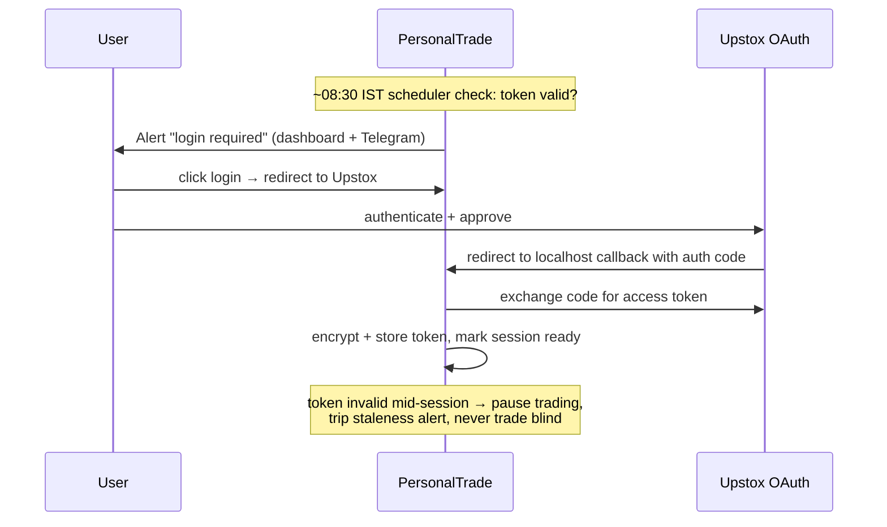

# 06 · Configuration, Security & Operations

## Configuration strategy

Layered, last-wins, all validated by pydantic-settings into typed config objects at startup —
misconfiguration fails fast, before any market connection.

```
config/default.yaml      # committed: safe defaults, paper mode, conservative limits
config/local.yaml        # git-ignored: user overrides
.env                     # git-ignored: secrets only (keys, tokens)
environment variables    # highest precedence (PT_ prefix)
```

Key sections (illustrative):

```yaml
trading:
  mode: paper                 # paper | live  ← THE switch (Rule 11)
  live_orders_enabled: false  # second gate; both must be set for live orders
  universe: [RELIANCE, HDFCBANK, INFY]
risk:
  capital: 500000             # ₹, Decimal
  risk_per_trade_pct: 1.0
  max_open_positions: 5
  max_daily_loss_pct: 3.0
  kill_switch:
    max_consecutive_errors: 5
ai:
  enabled: true
  provider: anthropic
  model: claude-opus-4-8
  max_tokens_per_call: 2048
  daily_call_cap: 100
  monthly_usd_cap: 25
data:
  candle_root: data/candles
  db_path: data/personaltrade.db
```

**Two-key rule for live trading:** `mode: live` AND `live_orders_enabled: true` must both be set,
and the app logs a prominent banner at startup stating the active mode. Paper is the default in
every layer.

## Security architecture

### Secrets
- Secrets only in `.env` / environment (Rule 15): `UPSTOX_API_KEY`, `UPSTOX_API_SECRET`,
  `ANTHROPIC_API_KEY`, dashboard password hash, token-encryption key.
- Upstox access token (rotates daily) stored encrypted at rest (Fernet, key from `.env`) in SQLite.
- `.gitignore` covers `.env`, `config/local.yaml`, `data/` from day one; pre-commit secret scan.

### Upstox authentication flow (daily-token reality)



Upstox tokens expire daily (~3:30 AM IST) — the design treats morning re-auth as a routine,
alert-driven step, and token invalidity during hours as a trading-pause condition.

### Dashboard auth
Single user, localhost-first: password (argon2 hash) → signed session cookie; CSRF on mutating
routes; kill-switch reset and live-mode toggles require re-entering the password. If ever exposed
beyond localhost, bind behind Tailscale/VPN — never port-forwarded raw.

### Other
- LLM: news text treated as hostile input (see [05-ai-data-flow.md](05-ai-data-flow.md)); AI can
  never reach the order path.
- Dependencies pinned via `uv.lock`; periodic `pip-audit` in CI step.
- Logs never contain secrets or full tokens (structlog processor redacts).

## Paper trading architecture (summary)

Paper mode = real live data + simulated execution. The paper broker implements the same `Broker`
interface, consumes real quotes, applies the **same cost model as the backtester** (brokerage, STT,
stamp duty, GST, SEBI/exchange charges) plus slippage and latency simulation, persists positions
and funds, and emits the same `OrderUpdate` stream. Nothing upstream knows it's paper — that
symmetry is the whole point (Rules 7, 11, 12).

## Broker integration architecture (summary)

`execution/upstox/` wraps Upstox API v2: REST for orders/positions/funds, websocket for order
updates and market data. Transport concerns (retries with backoff, rate-limit respect, error
mapping to typed statuses) are isolated in a thin client; the `Broker` implementation above it is
transport-agnostic. Staged rollout per M17: read-only first, order placement behind the two-key
config gate, smallest-quantity smoke test only with explicit user approval.

## Operations

- **Runbook (M20):** daily open/close procedure, incident response, recovery drill.
- **Backups (M19):** nightly copy of `data/` (SQLite + Parquet manifests) with retention; restore
  drill part of M20 review.
- **Time:** all storage UTC; NSE calendar module is the single authority for sessions/holidays;
  scheduler jobs are calendar-aware.
- **Single instance enforcement:** lockfile prevents two processes trading the same account.
